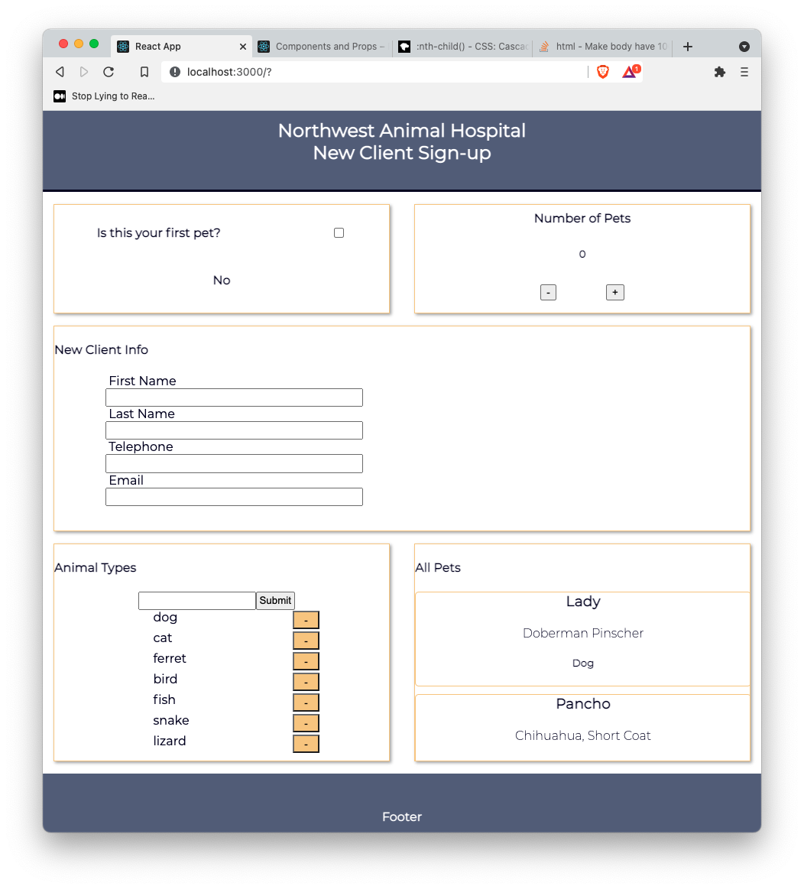

# React Classes to Hooks Conversion Lab

In this lab, you will build a simple page that will show a simple sign up page that also access an external API. The goals are:

- Rewrite all the components from class components
- Add hooks
- Change state using hooks
- Use `useEffect` as the lifecycle method for updating a component after an API call

Each of the sections below (in the gold border) is its own component. Focus on completing the distinct components. There is not an overall "form" or "feature" to complete.



---

## Lab Setup

### Getting started

1. Fork and clone this repository.

1. Navigate to the cloned repository's directory on your command line. Then, run the following command:

   ```
   npm install
   ```

   This will install the libraries needed to run the tests.

1. Open up the repository in VSCode. Follow the instructions below to complete the Lab.

### Tests

To run the tests, you can run the following command from the command line. You will need to be in the root directory of your local directory.

```
npm test
```

This will open the Cypress testing window, where you can click to run an individual suite of tests or all of the tests at once.

#### Testing Tips

Keep the following in mind for this lab as you run the tests.

1. While running your tests, you must have a server up and running in another terminal. This means you will have _both_ a terminal window running the actual React application _and_ a terminal window running the tests.

1. When creating a component, make sure to create and import it with the same name as the file name. For example, the component created and exported inside of the `NavBar.js` file should be `NavBar`. The tests look for these specific names.

1. While the `cypress-watch-and-reload` package has been installed in this project, sometimes the React application will take longer to reload than the tests. If you feel as though a test should be passing that isn't, try pressing the re-run button in the Cypress tests before asking for help.

## Instructions

- `NavBar` - convert to functional component
- `Footer` - convert to functional component
- `FirstPet` - [Work with a Boolean]
  - Convert to functional component
  - Use a checkbox to update state of `firstPet` to have a value `true` or `false`
  - Use conditional rendering to render the word `No` if the checkbox is unchecked
  - Use conditional rendering to render the word `Yes` if the checkbox is checked
- `NumOfPets` - [Work with numbers, work with multiple functions]
  - Convert to a functional component
  - Add two buttons one that says `-` and one that says `+`
  - On click of `+` increase the number of pets by 1
  - On click of `-` decrease the number of pets by 1, Do not allow for a negative amount of pets
- `NewClient` - [Work with strings, work with multiple stateful properties]
  - Convert to functional component
  - Make sure your form contains:
    - `firstName`, type `"text"`
    - `lastName`, type `"text"`
    - `phone`, type `"tel"`
    - `email`, type `"email"`
  - Render the values in an `article` alongside the form as you type
- `AnimalTypes` - [Work with arrays]
  - Convert to functional component
  - Be able to render a list of animals (already provided)
  - Be able to add to the list using a form and a submit input,
  - Do not allow for duplicates
  - Make sure that `cat ` and `cat` are all entered as `cat`
  - Be able to remove an animal with an on click of a button
- `PetList` - [Work with an external API, lifecycle method, pass props down to `Pet` component]
  - Make an API call to receive all pets (describe below)
  - Be able to render a list of the animals including their
    - `name`
    - `breed`
    - `kind`

### Using the API

Your instructor will either give you the URL for the API you will be accessing or tell you to run the API locally. There will be only one endpoint
you will need to hit.

If you need, you can access the API at the following repository. Follow the instructions there to get it installed.

- [Resource: Veterinarian API](https://github.com/joinpursuit/resource-veterinarian-api)

#### `/api/pets`

Making a GET request to this path will return an array of pets. The response will look similar to the one below.

```js
[
  {
    id: "dGXf5O9",
    name: "Lady",
    kind: "Dog",
    breed: "Doberman Pinscher",
    employeeId: "z7GIN_i",
  },
  // ...
];
```
